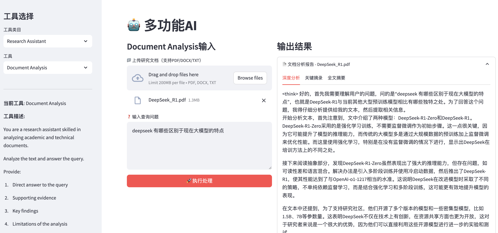
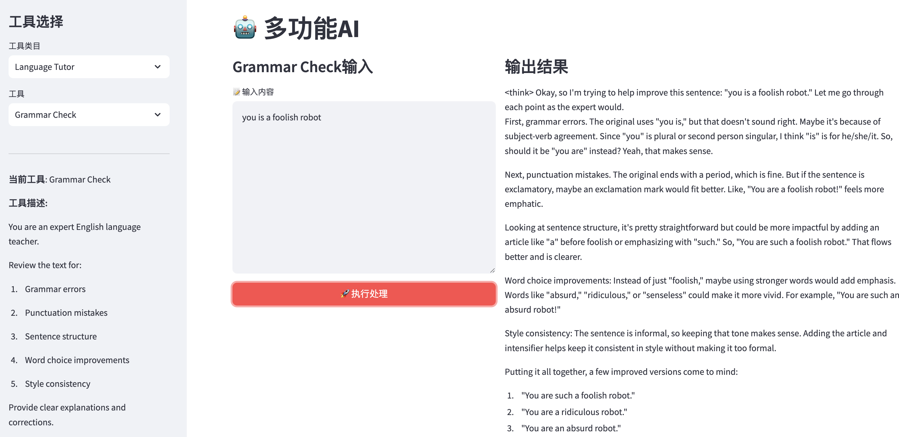
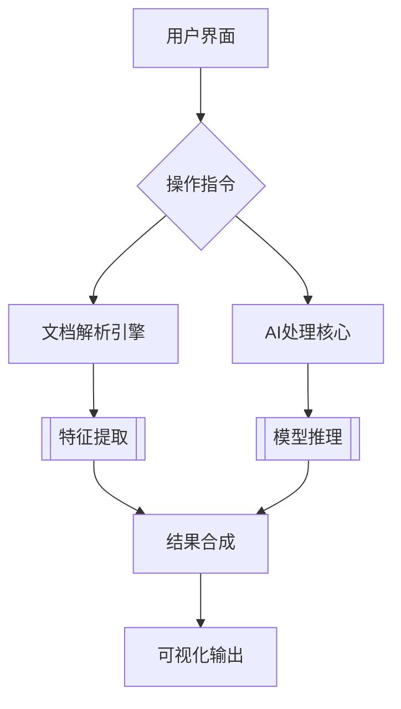

# AI Multi-Assistant Platform

[](https://opensource.org/licenses/MIT)
[](https://hub.docker.com/r/username/ai-assistant)
[](https://www.python.org/)

智能文档处理与多场景AI协作平台，支持本地模型和云端服务混合部署。




## 🌟 核心功能

### 多模态处理能力
- 📄 智能文档解析（PDF/Word/Excel）
- 🖼️ 图像内容识别与描述生成
- 📊 数据可视化分析通道
- 📝 自动化报告生成系统

### 部署特性
- 🐳 全容器化部署方案
- 🔄 支持混合云架构
- 📶 离线模式支持

## 🧬 技术架构

### 核心组件
| 领域          | 技术选型                          |
|---------------|-----------------------------------|
| **前端框架**   | Streamlit 1.34+                   |
| **AI引擎**     | OpenAI Python v1.14+/ollama       |
| **文档处理**   | PyPDF2, python-docx, pandas       |
| **容器化**     | Docker 24.0+                      |
| **异步处理**   | asyncio, concurrent.futures       |

### 架构亮点


### 🚀 快速部署
- Docker Engine

```bash
# 构建镜像
docker build -t ai-assistant:office .

# 运行镜像
docker run -d \
  -p 8501:8501 \
  -e OPENAI_API_KEY="your_api_key" \
  -e OPENAI_BASE_URL="http://ollama-host:11434/v1" \
  -e MODEL="deepseek-r1:70b"
  --restart unless-stopped \
  --name ai-prod \
  ai-assistant:prod
```

### License
The MIT License
